# F1R3FLY Node State Diagram

## Overview

The F1R3FLY node operates as a **hierarchical, concurrent state system**. This document shows the complete lifecycle from node startup through deployment processing to block finalization.

## Complete Node & Transaction Lifecycle Flow

This diagram shows the end-to-end flow from node startup through transaction processing:

```mermaid
flowchart TD
    START([Node Binary Starts]) --> CONFIG[Load Configuration]
    CONFIG --> MODE{Determine Mode}
    
    MODE -->|Regular Node| BOOTSTRAP[Connect to Existing Node ID]
    MODE -->|Genesis Validator| GENESIS_V[Join Genesis Ceremony]
    MODE -->|Ceremony Master| GENESIS_M[Lead Genesis Ceremony]
    MODE -->|Standalone| STANDALONE[Create Isolated Network]
    
    BOOTSTRAP --> SYNC[Sync Blockchain State]
    GENESIS_V --> GENESIS_FLOW[Genesis Protocol]
    GENESIS_M --> GENESIS_FLOW
    STANDALONE --> RUNNING
    
    GENESIS_FLOW --> SYNC
    SYNC --> RUNNING[🟢 Node Running]
    
    %% Transaction Processing Flow
    RUNNING --> DEPLOY_POOL[📨 Receive Deploy]
    DEPLOY_POOL --> BLOCK_CREATE{Validator Creates Block?}
    
    BLOCK_CREATE -->|Yes - I'm Proposer| CONTRACT[🔄 Rholang Contract Execution]
    BLOCK_CREATE -->|No - Receive Block| BLOCK_RX[📨 Receive Block from Network]
    
    BLOCK_RX --> VALIDATE[Validate Block]
    VALIDATE --> CONTRACT
    
    CONTRACT --> PATTERN[Pattern Matching in RSpace]
    PATTERN --> STATE_UPDATE[Update Blockchain State]
    STATE_UPDATE --> BLOCK_VALID[✅ Block Valid]
    
    BLOCK_VALID --> BROADCAST[📡 Broadcast Block]
    BROADCAST --> FINALIZE[Add to DAG & Finalize]
    
    %% Styling
    style RUNNING fill:#4caf50,color:#fff
    style CONTRACT fill:#ff9800,color:#fff
    style PATTERN fill:#2196f3,color:#fff
    style BLOCK_VALID fill:#8bc34a,color:#fff
    style GENESIS_FLOW fill:#9c27b0,color:#fff
```

## Contract Execution Deep Dive

When a block contains Rholang deployments, here's the detailed execution flow:

## Validator Block Creation

For validator nodes that create blocks:

```mermaid
flowchart TD
    TRIGGER[⏰ Propose Trigger] --> CHECK{Am I Active Validator?}
    CHECK -->|❌| WAIT[⏳ Wait for Next Opportunity]
    CHECK -->|✅| CONSTRAINTS{Check Constraints}
    
    CONSTRAINTS --> SYNCHRONY{Synchrony Constraint Met?}
    SYNCHRONY -->|❌| WAIT
    SYNCHRONY -->|✅| HEIGHT{Height Constraint Met?}
    
    HEIGHT -->|❌| WAIT  
    HEIGHT -->|✅| SELECT[🏗️ Create Block]
    
    SELECT --> EXECUTE[🔄 Execute Deploys]
    EXECUTE --> SIGN[✍️ Sign Block]
    
    SIGN --> BROADCAST[📡 Broadcast to Network]
    BROADCAST --> WAIT
    
    style SELECT fill:#4caf50,color:#fff
    style EXECUTE fill:#ff9800,color:#fff
    style SIGN fill:#2196f3,color:#fff
```

## Block Validation Pipeline

When a node receives a block, it goes through this validation sequence:

### CBC Casper Validation Protocol

**Block Summary Validation** (`Validate.blockSummary`): 12-step validation including hash verification, timestamp bounds (±15s drift), shard consistency, deploy validation, and sequence number enforcement.

**Justification Regression Check** (`Validate.justificationRegressions`): Prevents validators from "going backwards" by enforcing `newJustification.seqNum >= currentJustification.seqNum` to maintain consensus safety.

**Block Checkpoint Validation** (`InterpreterUtil.validateBlockCheckpoint`): Deterministic replay of all deploys in RSpace to verify computed post-state hash matches block's claimed state.

**Bonds Cache Validation** (`Validate.bondsCache`): Verifies block's cached validator bonds exactly match current PoS contract state, ensuring authentic stake verification.

**Neglected Invalid Blocks** (`Validate.neglectedInvalidBlock`): Detects when bonded validators reference known invalid blocks in justifications, preventing Byzantine fault avoidance.

**Equivocation Detection** (`EquivocationDetector.checkNeglectedEquivocationsWithUpdate`): Identifies double-voting by comparing creator's self-justification with latest DAG message, maintaining equivocation tracker.

**Clique Oracle Safety** (`SafetyOracle`): Computes mathematical finality via `(cliqueWeight * 2 - totalStake) / totalStake`, finding maximum validator cliques that agree on target blocks.

**Key Parameters**: `fault-tolerance-threshold=0.99`, `synchrony-constraint-threshold=0.67`, `height-constraint-threshold=1000`

